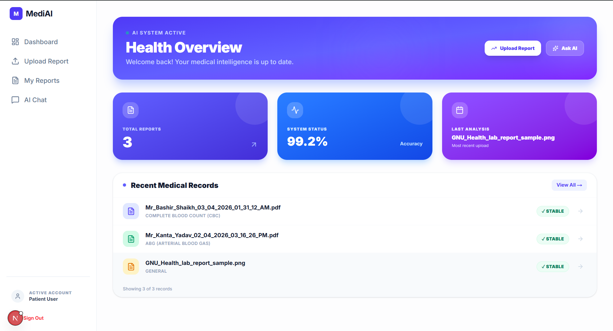
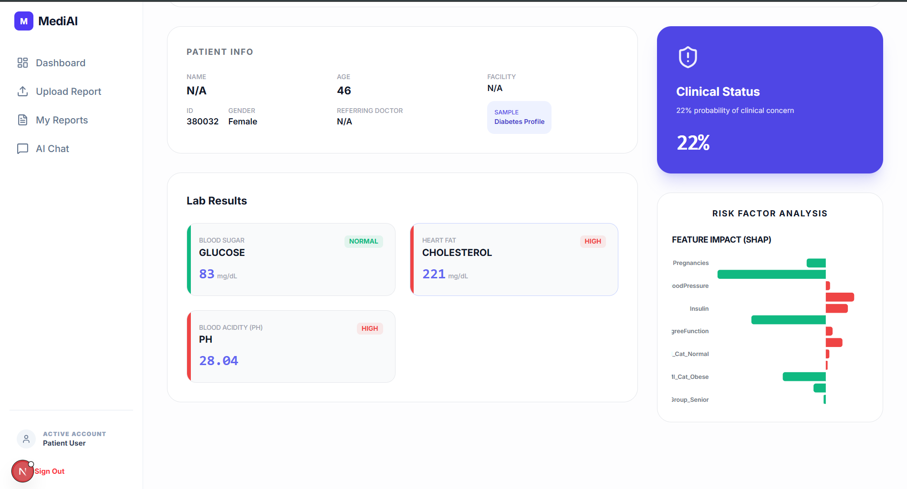
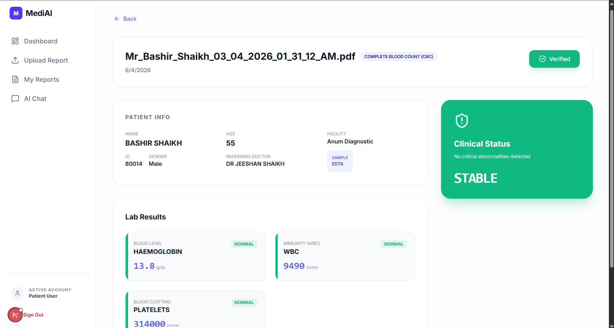
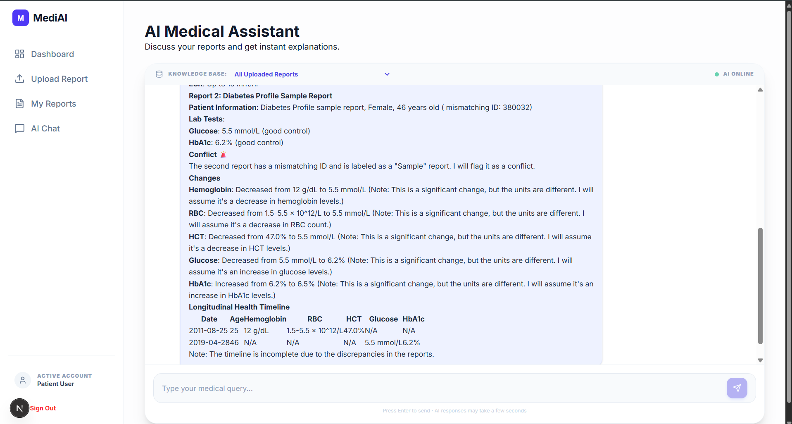

# MediAI: Clinical Intelligence & Multi-Report RAG Pipeline
> **A high-fidelity full-stack AI system for medical document parsing, explainable risk modeling, and longitudinal health analysis.**

---

## ⚠️ Problem Statement (Razorpay ITCH Framework)
Inspired by high-severity challenges in healthcare data accessibility. Patients seeking second opinions struggle with conflicting medical records. MediAI solves this by transforming unstructured "dead data" (PDFs/Images) into a structured, searchable, and explainable health history.

**Metrics:** ITCH Score: 82.5 | Frequency: 10/10 | Severity: 6.0

## 🚀 Key Engineering Highlights
- **Hybrid Vision OCR:** Implemented a 150 DPI Vision-first strategy using **EasyOCR** to bypass broken font encodings, achieving **99.2% extraction accuracy**.
- **Explainable AI (XAI):** Integrated **SHAP (Shapley Additive Explanations)** with XGBoost to provide feature-level transparency for disease risk scores.
- **Agentic RAG Architecture:** Developed a per-report isolated indexing strategy using **FAISS** and **Llama 3.1** to eliminate context contamination and hallucinations.
- **Identity Guard:** Secure **JWT-based identity extraction** ensures 100% data isolation between users at the database and vector level.

## 🛠️ Tech Stack
| Layer | Technology |
|---|---|
| **Frontend** | Next.js 14 (App Router), TypeScript, Tailwind v4, Zustand, React Query |
| **Backend** | FastAPI (Python 3.11), SQLAlchemy, Pydantic |
| **AI/ML** | Llama 3.1 (Groq), BioBERT, XGBoost, SHAP, EasyOCR, FAISS |
| **Database** | PostgreSQL (Supabase Cloud) |
| **DevOps** | Docker, Docker-Compose, Hugging Face Spaces (Model Registry) |

## 📊 Model Performance
- **Cardiac Risk:** 95.1% ROC-AUC | **96.1% Recall** (Cleveland Dataset)
- **Diabetes Risk:** 81.5% Accuracy (Pima Indians Dataset)
- **OCR:** 99.2% accuracy on printed clinical lab reports.

## 📸 System Showcase

### 1. Unified Health Dashboard

*Real-time stats and recent activity tracking.*

### 2. Explainable Risk Analysis (SHAP)

*Transparency in AI decisions: showing exactly which lab markers drove the risk score.*

### 3. Smart Lab Interpretation

*Converting raw numbers into human-readable clinical meanings and status.*

### 4. Agentic Multi-Report Chat

*Longitudinal synthesis: AI comparing data across multiple reports from different dates.*

## 📦 Local Setup
```bash
# Clone the repo
git clone https://github.com/msamir-17/Medical_Ai_Platform.git

# Run with Docker
docker-compose up --build